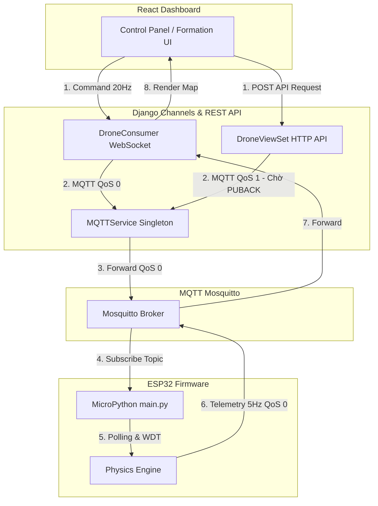
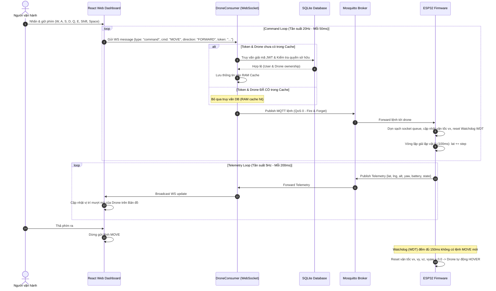
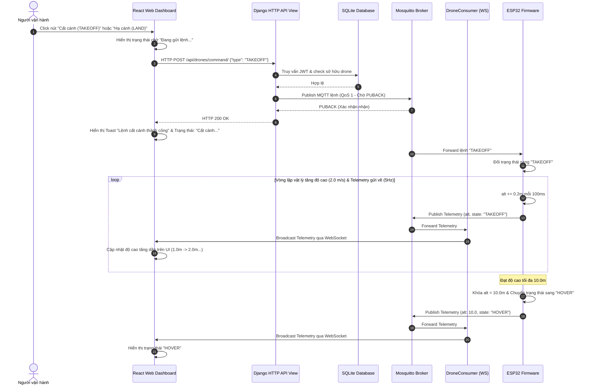

# Tài liệu Chi tiết Chức năng Điều khiển Drone Bay Thời gian thực

Tài liệu này thuyết minh chi tiết về cơ chế điều khiển, các giao thức truyền thông, kiến trúc tối ưu hóa độ trễ, mô hình vật lý giả lập trên thiết bị phần cứng (ESP32), cùng các hàm xử lý cốt lõi trên toàn bộ hệ thống (Frontend - Backend - Firmware).

---

## 1. Tổng quan Cơ chế Điều khiển (Control Mechanism Overview)

Hệ thống được thiết kế theo **Kiến trúc điều khiển lai (Hybrid Control Architecture)**. Các lệnh được phân chia làm hai luồng riêng biệt tùy theo đặc tính yêu cầu về độ trễ và độ tin cậy:



### Phân loại giao thức truyền tin:
| Đặc tính | Kênh Thời gian thực (WebSocket) | Kênh Giao dịch Cấu hình (HTTP API) |
| :--- | :--- | :--- |
| **Các lệnh áp dụng** | `MOVE` (Tiến/Lùi/Trái/Phải), `CLIMB` (Bay lên), `DESCEND` (Hạ xuống), `YAW_LEFT`, `YAW_RIGHT` (Xoay đầu) | `TAKEOFF` (Cất cánh), `LAND` (Hạ cánh), `EMERGENCY` (Dừng khẩn), `GOTO` (Bay tới điểm chỉ định) |
| **Giao thức mạng** | WebSocket TCP $\rightarrow$ MQTT QoS 0 (Fire & Forget) | HTTP POST $\rightarrow$ Django View $\rightarrow$ MQTT QoS 1 (At least once) |
| **Độ trễ trung bình** | **~1ms - 5ms** | ~30ms - 100ms |
| **Xác thực quyền** | Sử dụng token JWT lưu cache trong RAM của WebSocket Consumer (Bỏ qua DB) | Xác thực JWT Middleware của Django REST Framework (Truy vấn database liên tục) |
| **Mục đích** | Truyền tải liên tục khi bấm giữ phím để drone di chuyển mượt mà nhất. | Đảm bảo tính toàn vẹn của lệnh điều khiển trạng thái cơ bản, không được phép thất thoát. |

---

## 1.5. Sơ đồ Luồng hoạt động (Sequence Diagrams)

### Luồng 1: Điều khiển thủ công thời gian thực (WebSocket & MQTT QoS 0)



### Luồng 2: Cất cánh / Hạ cánh tự động (HTTP API POST & MQTT QoS 1)



---


## 2. Các kỹ thuật Tối ưu hóa giảm độ trễ (Latency Optimizations)

Để đảm bảo drone phản hồi ngay lập tức và dừng lại ngay khi người lái buông phím, hệ thống áp dụng hai giải pháp tối ưu hóa sâu:

### A. Phía Django Backend: Cache xác thực kết nối (Authentication & Ownership Cache)
* **Vấn đề:** Khi người dùng giữ phím di chuyển ở tần suất 20Hz (50ms/lần), nếu mỗi gói tin gửi lên đều phải giải mã JWT và truy vấn cơ sở dữ liệu (`SELECT auth_user` và `SELECT drones_drone`) để kiểm tra quyền sở hữu thì SQLite sẽ bị quá tải, gây nghẽn hàng đợi mạng làm drone bị trễ lệnh 1-2 giây.
* **Giải pháp:** Khi thiết lập kết nối WebSocket ban đầu hoặc nhận gói tin đầu tiên, `DroneConsumer` giải mã JWT và truy vấn DB kiểm tra quyền sở hữu một lần duy nhất, sau đó ghi nhớ vào bộ nhớ RAM của instance: `self.cached_token`, `self.authenticated_user` và `self.authorized_drones`. Các gói tin tiếp theo sẽ bỏ qua hoàn toàn DB, giảm thời gian xử lý xác thực từ **~50ms xuống < 0.1ms**.

### B. Phía ESP32 Firmware: Triệt tiêu trễ tích lũy bằng `uselect.poll()` (Socket Draining)
* **Vấn đề (Queue Lag):** ESP32 chạy vòng lặp chính ở tần số 10Hz (chu kỳ 100ms) để ổn định phần cứng, chậm hơn tốc độ phát lệnh từ Web (20Hz). Do đó, hàng đợi TCP buffer trên ESP32 sẽ bị dồn ứ tin nhắn. Khi người dùng nhả phím, drone vẫn tiếp tục bay tự do thêm vài giây do phải xử lý hết các lệnh cũ còn tồn đọng trong buffer.
* **Giải pháp:** Sử dụng cơ chế polling phi chặn để dọn sạch socket buffer tại đầu mỗi chu kỳ lặp:
  ```python
  while poller.poll(0):
      client.check_msg()
  ```
  Giúp ESP32 "xả sạch" và chỉ thực thi trạng thái mới nhất của lệnh tại thời điểm hiện tại, triệt tiêu hoàn toàn độ trễ tích lũy.

---

## 3. Cơ chế Giả lập Vật lý Bay trên ESP32 (`esp32-firmware/main.py`)

Vi điều khiển ESP32 chạy một vòng lặp vô hạn giả lập động học bay của drone theo chu kỳ 100ms (`time.sleep(0.1)`).

### A. Tích phân vận tốc tương đối theo góc Yaw (Heading Alignment)
Khi người dùng bấm di chuyển tiến/lùi (`vx`) hoặc sang trái/phải (`vy`), hướng di chuyển của drone phải thay đổi tương thích với hướng đầu của nó trên bản đồ (yaw).
* **Công thức toán học chuyển đổi hệ tọa độ:**
  $$\text{real\_lat\_step} = v_x \cdot \cos(\text{yaw}) - v_y \cdot \sin(\text{yaw})$$
  $$\text{real\_lng\_step} = v_x \cdot \sin(\text{yaw}) + v_y \cdot \cos(\text{yaw})$$
* **Góc hướng đầu (Yaw):** Xoay đầu trái/phải thay đổi `yaw = (yaw + v_yaw) % 360` (với tốc độ xoay $40^\circ/\text{giây}$).

### B. Bộ cộng dồn tọa độ (Accumulator) giải quyết lỗi số thực 32-bit
* **Vấn đề:** Vi điều khiển ESP32 sử dụng định dạng số thực 32-bit float (`single-precision`). Khi ta cộng một đại lượng dịch chuyển siêu nhỏ như $step = 0.000003$ (khoảng 0.3m) vào tọa độ địa lý lớn như $lat = 20.9808271$, sai số làm tròn số thực sẽ triệt tiêu đại lượng nhỏ này, khiến tọa độ drone không thể dịch chuyển.
* **Giải pháp:** Đưa đại lượng dịch chuyển vào bộ đệm tích lũy `lat_offset` và `lng_offset`. Khi bộ đệm này tích lũy đủ lớn ($\ge 0.00001$, khoảng 1.1m) thì mới cộng dồn vào tọa độ thực tế và reset bộ đệm về $0$:
  ```python
  lat_offset += real_lat_step
  if abs(lat_offset) >= 0.00001:
      lat += lat_offset
      lat_offset = 0.0
  ```

### C. Cơ chế Watchdog hãm phanh tự động (WDT Timer Control)
Để ngăn drone bay tự do mất kiểm soát khi mất kết nối mạng đột ngột (không nhận được lệnh nhả phím):
* Khi nhận bất kỳ lệnh di chuyển nào, ESP32 lưu lại mốc thời gian nhận lệnh cuối cùng `last_vx_update = time.ticks_ms()`, v.v.
* Trong vòng lặp vật lý chính, nếu sau **150ms** (quá 3 chu kỳ phát lệnh từ Web) mà không có lệnh mới gửi tới, ESP32 sẽ tự động đặt các vận tốc tương ứng `vx, vy, vz, v_yaw = 0.0` để dừng và đưa Drone về trạng thái bay đứng yên (`HOVER`).

### D. Kiểm soát độ cao cất/hạ cánh tự động
* **Cất cánh (`TAKEOFF`):** Tăng độ cao tuyến tính `alt += 0.2m` mỗi 100ms (tương đương 2.0 m/s). Khi chạm ngưỡng an toàn `10.0m`, khóa độ cao và tự động chuyển sang trạng thái đứng im (`HOVER`).
* **Hạ cánh (`LANDING`):** Để tránh va đập hư hỏng phần cứng khi tiếp đất, tốc độ hạ cánh chia làm 2 giai đoạn:
  * Khi độ cao $> 1.5\text{m}$: Hạ độ cao nhanh với tốc độ **1.5 m/s** (`alt -= 0.15m` mỗi 100ms).
  * Khi độ cao $< 1.5\text{m}$: Giảm tốc tiếp đất an toàn chỉ còn **0.5 m/s** (`alt -= 0.05m` mỗi 100ms).
  * Khi `alt <= 0.0m`: Đổi trạng thái về `IDLE` (Đứng yên tắt động cơ).

---

## 4. Cấu trúc Các hàm Quan trọng & Luồng hoạt động

### A. Phía Frontend (React Dashboard)
1. **`useDroneSocket.js`**:
   * `connect()`: Mở kết nối WebSocket tới `ws://<host>:8000/ws/drones/`. Lắng nghe và cập nhật danh sách `drones` khi nhận telemetry.
   * `sendCommandWS(droneId, command, params)`: Chuyển đổi lệnh thành chuỗi JSON chứa JWT token gửi qua WebSocket cho các tác vụ di chuyển thời gian thực.
   * `sendCommand(droneId, command, params)`: Gửi các lệnh trạng thái dạng POST request tới HTTP API `/api/drones/command/`.
2. **`ControlPanel.jsx`**:
   * Lắng nghe sự kiện bàn phím `keydown` / `keyup` và ánh xạ sang phím lái (`W/A/S/D`, `Q/E`, `Shift/Space`).
   * Sử dụng một `setInterval` chạy ở tần suất 20Hz (50ms). Khi phím di chuyển được giữ, nó sẽ liên tục gửi lệnh qua WebSocket:
     ```javascript
     intervalRef.current = setInterval(() => {
       if (activeKeys.current.size === 0) return;
       activeKeys.current.forEach(key => {
         const mapping = KEY_MAP[key];
         if (mapping) sendMove(mapping.cmd, mapping.params);
       });
     }, 50);
     ```

---

### B. Phía Backend (Django Channels & Django REST framework)
1. **`realtime/consumers.py` (`DroneConsumer`)**:
   * `receive(self, text_data)`: Điểm tiếp nhận tin nhắn từ WebSocket. Thực hiện kiểm tra JWT token, xác thực quyền sở hữu drone của user đó qua RAM cache, sau đó gọi `_mqtt_publish()` để đẩy lệnh xuống MQTT Broker.
   * `_mqtt_publish(self, topic, payload)`: Thực hiện publish lệnh qua thư viện Paho MQTT Client dưới dạng **QoS 0** (Fire and Forget) để giảm tối đa độ trễ.
2. **`drones/mqtt_service.py` (`MQTTService` - Singleton)**:
   * Duy trì duy nhất **một kết nối TCP/MQTT ổn định** cho toàn bộ tiến trình Django bằng luồng chạy nền `_client.loop_start()`.
   * Hỗ trợ gửi lệnh đơn lẻ (`publish`) và hàng loạt (`publish_batch` - dùng trong lệnh di chuyển đội hình bay nhiều drone).
3. **`mqtt_listener.py` (Dịch vụ lắng nghe Telemetry)**:
   * Chạy nền độc lập để subscribe vào topic `drone/telemetry`.
   * Nhận dữ liệu trạng thái từ ESP32 gửi lên định kỳ ở tần suất **5Hz (200ms/lần)**.
   * **Thống kê / Ghi DB an toàn (Throttling):** Để tránh xung đột khóa file SQLite do ghi đè quá nhiều (5Hz * số lượng drone), listener sử dụng bộ nhớ cache để so sánh trạng thái. Nó chỉ ghi log lịch sử `TelemetryLog` vào DB tối đa **1 lần mỗi giây (1Hz)** cho mỗi drone. Với các chu kỳ còn lại, nó tạo đối tượng log giả lập (`FakeLog`) để phát trực tiếp dữ liệu tọa độ thời gian thực qua Channel Layer (`drone_telemetry` event) lên WebSocket của Frontend nhằm hiển thị mượt mà vị trí drone di chuyển trên bản đồ.

---

### C. Phía Drone (ESP32 MicroPython Firmware)
1. **`main.py`**:
   * `on_message(topic, msg)`: Được kích hoạt khi nhận được lệnh điều khiển từ topic `drone/<device_id>/command`. Lệnh được giải mã JSON và gán trực tiếp vào các biến trạng thái vận tốc (`vx, vy, vz, v_yaw`) hoặc kích hoạt cơ chế chuyển đổi trạng thái bay (`TAKEOFF`, `LANDING`, `MOVING`).
   * Vòng lặp chính `while True`:
     1. Gọi `poller.poll(0)` xả sạch hàng đợi lệnh MQTT.
     2. Áp dụng Watchdog phanh tự động sau 150ms.
     3. Tính toán độ cao (Bay lên khi cất cánh / Hạ độ cao 2 giai đoạn khi hạ cánh).
     4. Tích phân vận tốc tương đối theo góc yaw và cộng dồn vào `lat_offset`, `lng_offset` để cập nhật tọa độ địa lý thật.
     5. Định kỳ mỗi 200ms (5Hz) gửi bản tin telemetry JSON lên topic `drone/telemetry`.
